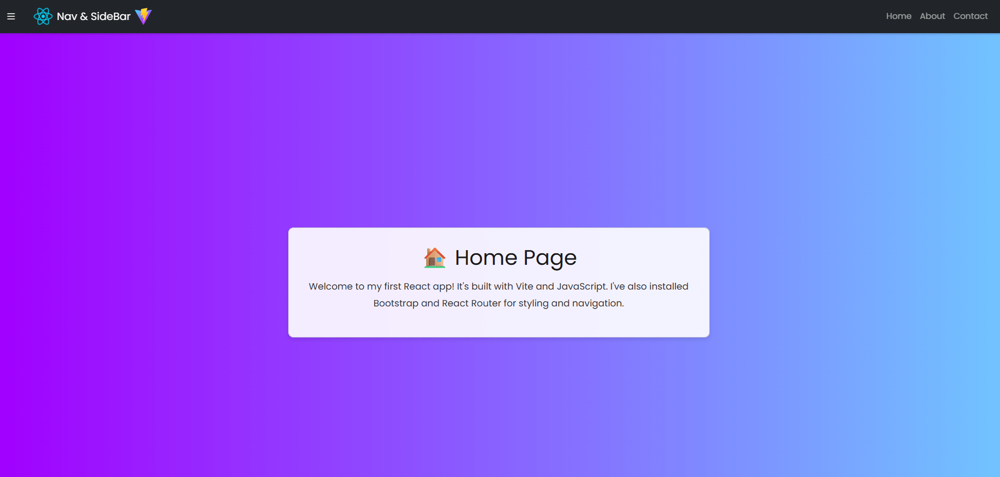
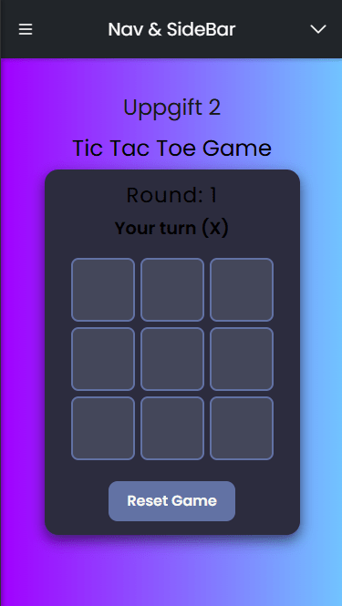

# NavAndSideBar

A responsive React application featuring a top navigation bar and a collapsible sidebar, deployed on GitHub Pages. This project showcases client-side routing with `react-router-dom`, mobile responsiveness, and a clean UI built with Bootstrap.

**🔗 [Live Demo](https://tombenrex.github.io/NavAndSideBar/)**

---

## 🚀 Features

- **Responsive Navigation Bar** – A top navbar with a toggle button for the sidebar on smaller screens.
- **Collapsible Sidebar** – Sidebar slides in/out on mobile for optimal usability.
- **Client-Side Routing** – Smooth navigation using `react-router-dom` for Home, About, Contact, TaskTwo, and TaskThree.
- **404 Handling** – Custom 404 page with redirect support on GitHub Pages.
- **Bootstrap Integration** – Clean and responsive UI using Bootstrap.
- **Vite-Powered** – Fast dev server and optimized production builds via Vite.

---

## 📁 Project Structure

```bash
NavAndSideBar/
├── public/
│   ├── index.html
│   ├── 404.html
│   └── assets/
│       ├── pre1.png
│       └── pre2.png
├── src/
│   ├── components/
│   │   ├── header/
│   │   │   └── NavBar.jsx
│   │   ├── sidebar/
│   │   │   └── SideBar.jsx
│   │   └── pages/
│   │       ├── Home.jsx
│   │       ├── About.jsx
│   │       ├── Contact.jsx
│   │       ├── Task2.jsx
│   │       ├── Task3.jsx
│   │       └── NotFound.jsx
│   ├── App.jsx
│   ├── App.css
│   ├── main.jsx
│   └── index.css
├── package.json
├── vite.config.js
└── README.md
```

---

## 🛠️ Installation

To run the project locally:

```bash
# Clone the repo
git clone https://github.com/tombenrex/NavAndSideBar.git
cd NavAndSideBar

# Install dependencies
npm install

# Start dev server
npm run dev
```

Open [http://localhost:5173/NavAndSideBar/](http://localhost:5173/NavAndSideBar/) in your browser.

---

## 🏗️ Build & Deployment

```bash
# Build for production
npm run build

# Deploy to GitHub Pages
npm run deploy
```

> Ensure the correct base path is set in `vite.config.js` and `package.json` (see below).

---

## 📦 Dependencies

- **React** – Front-end UI library.
- **react-router-dom** – For client-side routing.
- **Bootstrap** – For responsive design.
- **Vite** – Build tool for fast dev and production.
- **gh-pages** – For GitHub Pages deployment.

See `package.json` for the full list.

---

## 🔀 Routing

The app uses `react-router-dom` for seamless client-side routing. Available routes:

- `/` – Home
- `/about` – About
- `/contact` – Contact
- `/tasktwo` – Task Two
- `/taskthree` – Task Three
- Any other path renders the custom 404 page.

---

## 📤 GitHub Pages Setup

This project is deployed to GitHub Pages.

To ensure routing works:

- `vite.config.js`:
  ```js
  base: '/NavAndSideBar/',
  ```
- `package.json`:
  ```json
  "homepage": "https://tombenrex.github.io/NavAndSideBar"
  ```
- `public/404.html`: Redirects unknown paths to `index.html` to support sub-routes.

---

## 📸 Screenshots

### 🖥️ Desktop View



[🔍 View Full Image](src/assets/pre2.png)

### 📱 Mobile View



[🔍 View Full Image](src/assets/pre1.png)
